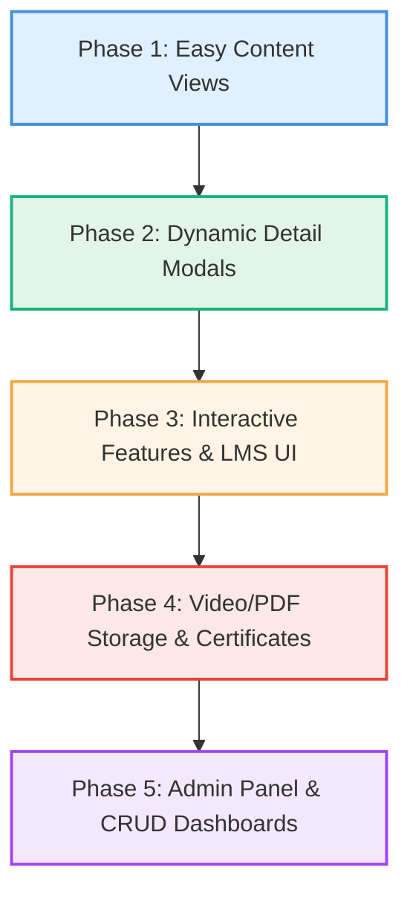

# ClimaMedix (كلايما ميدكس) 🌍🩺
An educational and community platform for Climate & Health in the Arab region. ClimaMedix is designed as a fast-loading, mobile-responsive Progressive Web Application (PWA) with full right-to-left (RTL) Arabic support (default) and left-to-right (LTR) English support.
---
## 📊 Detailed Functional Specifications & Role Permissions
This section defines the precise data schemas, content options, and role-based access control (RBAC) matrix for the platform.
### 1. 👤 User Profiles & Registration Fields
To properly register and track healthcare practitioners and climate advocates, profiles must store the following details in the database:
*   **Title / اللقب:** Translatable Enum field (`Dr` / دكتور, `Prof` / بروفيسور, `Mr` / سيد, `Ms` / سيدة) to support localization.
*   **Full Name / الاسم الكامل**
*   **Location / الموقع الجغرافي:** City (المدينة) and Country (الدولة)
*   **Birth Date / تاريخ الميلاد**
*   **University or Organization / الجامعة أو المؤسسة**
*   **Current Profession/Work / العمل الحالي**
*   **Specialty / التخصص الدقيق**
*   **Activist Status / هل أنت ناشط؟:** Boolean toggle
*   **Field of Activism / مجال النشاط:** (e.g., Public Health / الصحة العامة)
*   **Researcher Status / هل أنت باحث؟:** Boolean toggle
*   **Research Field / مجال البحث:** (e.g., Environmental Health / الصحة البيئية)
*   **Bio / نبذة تعريفية:** A short description of the user or a link to an uploaded CV.
### 2. 📚 Learning Hub (LMS) & Progress Tracking
*   **Course Formats:**
    *   **Text-Based Lessons:** Includes an interactive **Text-to-Speech (TTS)** voice option for accessibility and listening on the go.
    *   **Video Lessons:** Standard video streaming lessons.
*   **Engagement Tracking:**
    *   [ ] **Course Progress:** Track individual student lesson completions and progress percentages.
    *   [x] **Engagement Metrics (Articles):** Collect and display live **Views** and user **Likes** (Reactions) securely tracked in Supabase with RLS protections.
    *   [ ] **Engagement Metrics (Courses/Research):** Collect and display views, likes, and comments for courses and research publications.
### 3. 🧪 Research Tracks
1.  **Track 1: Community Health Educator (مسار التثقيف الصحي المجتمعي):** Primarily focused on course completion and community guidance.
2.  **Track 2: Professional Research Track (مسار البحوث والدراسات):** Users can sign in to participate in advanced courses and contribute scientific findings.
### 4. 🔑 Access Control & Role Permissions Matrix
The system enforces distinct user access levels to safeguard content copyright and incentivize registration/payment. To support a clean Object-Oriented Programming (OOP) model, permissions are stored in a dedicated database schema.
#### 🗄️ Permissions Database Schema (OOP Security Model)
Instead of hardcoding roles, permissions are mapped dynamically in the database via the following relational tables:
1. `roles` (id, role_name, description)
2. `permissions` (id, perm_key, description) - e.g., `manage:courses`, `write:articles`, `approve:users`, `issue:certs`, `review:posts`
3. `role_permissions` (role_id, permission_id) - maps roles to their authorized capabilities
4. `user_roles` (user_id, role_id) - assigns roles to users
#### 👥 Platform Roles Hierarchy
| Role / Access Level | Home Page | News & Articles | Research Papers | Courses | Publishing & Action Rights | Admin & Moderation Powers |
| :--- | :--- | :--- | :--- | :--- | :--- | :--- |
| **1. Unsigned User (غير مسجل)** | Full View | Titles & Thumbnails only (Teaser prompts) | Titles & Thumbnails only (Teaser prompts) | Titles & Thumbnails only (Teaser prompts) | None | None |
| **2. Unpaid Signed User (مسجل مجاني)** | Full View | Selected/Free Articles only | Selected/Free Research only | Selected/Free Courses only | Can submit application forms to become a Researcher or Community Health Educator | None |
| **3. Paid Signed User (مشترك مسجل)** | Full View | All Articles | All Research Papers | All Courses | None | None |
| **4. Researcher (باحث معتمد)** | Full View | All Articles | All Research Papers | All Courses | Can write & publish research/articles, and create courses | None |
| **4.5. Community Health Educator (مثقف صحي مجتمعي)** | Full View | All Articles | All Research Papers | All Courses | Can host & schedule lectures (in-person or online) | None |
| **5. Administrator (مشرف)** | Full View | All Articles | All Research Papers | All Courses | Can create courses and write articles | Moderation control based on specialized sub-roles (see Admin Role Types) |
| **6. Super Admin (مدير النظام)** | Full View | All Articles | All Research Papers | All Courses | Full publishing rights | Full System Control (logs on via a secret method; edits system configurations & DB logs) |
#### 🛡️ Administrator Sub-Roles & Granular Permissions
Admins are assigned granular permission bits to prevent data abuse and isolate duties:
*   **Course Manager (إدارة المسارات):** Permission `manage:courses` - Create, edit, and delete courses.
*   **Content Writer (كتابة المقالات):** Permission `write:articles` - Draft and edit blog posts, news, and resources.
*   **Enrollment Officer (قبول المستخدمين):** Permission `approve:users` - Review and approve applications for Researchers and Educators.
*   **Certification Officer (منح الشهادات):** Permission `issue:certs` - Authorize and sign student certificates.
*   **Research Reviewer (اعتماد الأبحاث ومراجعة المنشورات):** Permission `review:posts` - Approve or delete articles and publications.
*Note: Normal users must write and submit a recruitment application ("انضم إلى فريق البحث" or "مثقف صحي مجتمعي") to be approved by admins before getting specialized rights.*
#### 🗃️ Database Enum Role Mapping
The role levels correspond to the following `role` column enum strings in the `profiles` table:
*   **Unsigned User:** Not stored in database (session-level guest).
*   **Unpaid Signed User:** `'user'`
*   **Paid Signed User:** `'subscriber'`
*   **Researcher:** `'researcher'`
*   **Community Health Educator:** `'educator'`
*   **Administrator:** `'admin'`
*   **Super Admin:** `'superadmin'`
#### 🧪 Local Permission Toggling for Superadmins (Testing Tool)
To facilitate seamless local testing of RLS-based visibility without switching accounts:
1. **Log in as Super Admin**: Ensure your account is assigned the 'superadmin' role in the database.
2. **Interactive Toggling**: In the user profile menu, click **صلاحيات الحساب النشطة / Active Account Permissions**.
3. **Toggle Capabilities**: Click on individual permissions (e.g., `write:opportunities`).
   * When disabled, the permission is struck through and colored gray (marked as "Disabled / معطلة").
   * The UI immediately updates dynamically (e.g., the "Post Opportunity" button will disappear if `write:opportunities` is deselected), allowing developers to test exact capability levels instantly on the frontend.
#### 🗺️ Testing Workflows (Courses & Quizzes)
**1. Student Flow (Learning & Evaluation)**
*   **Trigger Admin Mode:** Log in as a Super Admin, then open the profile dropdown.
*   **Permission Setup:** In "Active Account Permissions", ensure `view:all_courses` is toggled ON to simulate a paid subscriber/student.
*   **Navigate:** Go to the **Learning Hub** (`/learning-hub` or click "My Courses").
*   **Enrollment:** Click on a course and press "Enroll" (verify database `enrollments` table updates).
*   **Media Streaming:** Open a video lesson. Test custom player features (volume sliders, PiP, playback speed, "Copy Frame").
*   **Quizzes:** Reach the end of a module and start a Quiz. 
    *   *Validation test:* Deliberately fail the quiz. Check that you must select *all* correct checkboxes exactly to earn points (no partial credit).
    *   *Review Mode test:* Pass the quiz, then review it. Ensure only the correct answers you actually clicked are highlighted in green with a `✓`. Verify that incorrect choices and unselected correct choices give no hints (plain text).
**2. Admin Flow (Course Building)**
*   **Permission Setup:** In the profile dropdown's "Active Account Permissions", ensure `manage:courses` is toggled ON to simulate an Administrator.
*   **Navigate:** Go to **Admin Dashboard -> Course Builder** (`/admin/courses`).
*   **Drag & Drop:** Create a new course. Add multiple modules and drag-and-drop to reorder them. Add lessons inside modules.
*   **Quiz Creation:** Add a Quiz lesson. Add questions with multiple options. Mark more than one option as `is_correct` to test multi-select logic. Set a custom passing score.
*   **Publishing:** Save the course, toggle `manage:courses` OFF, and ensure you can view the course correctly as a student.
---
## 📋 Platform Development Todo List & Requirements Plan
This plan tracks the implementation progress of ClimaMedix against the official website requirements.
### 1. 🏠 Home Page Sections
*   [x] **Hero Banner:**
    *   [x] Main title
    *   [x] Short description
    *   [x] CTA Buttons: Explore Programs, Join Community
*   [x] **About ClimaMedix (Short Version):** Introduction section.
*   [x] **Featured Programs:** Visual cards grid.
*   [x] **Impact Statistics:**
    *   [x] Number of learners
    *   [x] Number of countries
    *   [x] Number of courses
    *   [x] Number of projects
*   [x] **Latest Opportunities:** Interactive cards grid.
*   [x] **Partners Section:** Slide logo wrap.
*   [x] **Contact Section:** Form inputs and social integrations.
### 2. ℹ️ About Us Subpages
*   [x] **Our Story:**
    *   [x] Vision & Mission
    *   [x] Core Values
    *   [x] Team Members
    *   [x] Partners
### 3. 🎓 Programs (Dynamic Management)
*   [x] **Dynamic program detail pages** managed through the admin panel (Unified with LMS Courses).
*   [x] **Standard Program Details Card/Layout:**
    *   [x] Title & Description
    *   [x] Cover Image
    *   [x] Objectives & Duration
    *   [x] Eligibility & Apply Button
    *   [x] Examples integrated: VSCHEF Fellowship, Climate Health Academy, Research Program
### 4. 📚 Learning Hub (LMS)
*   [x] **Learning Management System (LMS) Features:**
    *   [x] Course Categories (Training Courses Carousel)
    *   [x] Premium Custom Video Lessons Player (Decoupled modular architecture with a sleek Neon Glowing central play button, timeline scrubbing, fullscreen support, and professional SVGs)
    *   [x] Premium Custom Audio Player (Consistent dark-themed UI matching the video player, automatic waveform generation, and synchronized interactive UX)
    *   [x] High-Tech Control Sliders (Interactive volume and speed slider popups on both media players with expanded hitboxes, click-toggle mute functionality, and double-click speed reset)
    *   [x] Playback Speed Tuning (Precise speed range adjustment from 0.5x to 2.0x in 0.1 increments)
    *   [x] Advanced Player Tools (Picture-in-Picture Miniplayer support, "Copy Frame" screenshot functionality with Cloudflare R2 CORS integration, hover tooltips)
    *   [x] Course Builder Drag & Drop (Interactive lesson reordering within modules, across modules, and module-level reordering)
    *   [x] Lesson Duration Support (Integrated duration metadata in the database, course builder forms, and detail sidebar)
    *   [x] Collapsible Modules (Coursera-like sidebar module folding with animated chevron indicators)
    *   [ ] PDF Resources
    *   [x] Quizzes (Fully functional quiz builder, checkbox-based multi-correct questions, and student answer validation):
        *   **Multi-Selection Checkbox UI:** Supports selecting multiple options per question.
        *   **Exact-Match Grading:** Requires students to match the correct set of options exactly to earn points.
        *   **Post-Quiz Review Screen & Persistent Review Mode:**
            *   When completing a quiz or opening a previously passed quiz, a full interactive review screen is displayed inline (no more generic hero cards).
            *   **Strict Highlighting Rules:** Only correct answers that the user *actually selected* are highlighted in green with a ✓.
            *   **No Spoilers/Hints:** Incorrectly selected answers, and correct answers that the user *missed*, are kept entirely plain (no red highlighting, no hints). This forces the student to figure out the right answer on their own during retries.
        *   **Polished UI:** Refined SVG navigation icons and responsive layout for quiz interactions.
    *   [x] Progress Tracking & Completed Lesson Badges (Dynamic vertical stepper timeline connecting completed lessons with brand colors)
    *   [x] Toggle Lesson Status (Interactive completion badges that allow unmarking lessons to dynamically reset progress)
    *   [ ] Certificates
    *   [ ] **Note:** Further testing is needed for courses to ensure all edge cases and module workflows are perfectly stable.
*   [x] **User Dashboard:**
    *   [x] My Courses (Active and Completed courses split, fetching DB-calculated individual progress and remaining lesson counts)
    *   [x] Overall Analytics (Dynamic "Total Progress Percentage" mathematically averaging exact progress across all enrolled courses)
    *   [x] Completed Courses (Rendering fetched completed courses)
    *   [ ] Certificates (UI built, auto-generation pending)
    *   [x] Quiz Results (Users can view their passed scores directly within the course modules)
### 5. 🧪 Research Center
*   [x] **Sections Layout:**
    *   [x] Research Projects Showcase
    *   [x] Publications Abstract Registry
    *   [x] Research Database
    *   [x] Join Research Team Form (Join Us Page with track selection [Research Track / Community Health Educator], "Are you a researcher?" conditional field, Cloudflare R2 CV upload, IP-based location detection, and granular 'approve:users' admin view)
*   **Publication Detail Fields:**
    *   [x] Title & Authors
    *   [x] Abstract
    *   [x] Download PDF Button
### 6. 💼 Opportunities (Admin Postings)
*   [x] **Opportunities Database & Display:**
    *   [x] Fellowship postings
    *   [x] Scholarship postings
    *   [x] Internship postings
    *   [x] Conference postings
    *   [x] Grant postings
*   [x] **Opportunity Details Layout:** Description, Eligibility, Deadline, and Apply Link.
*   [x] **Interactive Post Panel:** Glassmorphic modal gated by role/permissions with dynamic RLS permission mappings.
### 7. 🤝 Community
*   [x] **Community Roles Section:** Fellows Network, Ambassadors, and Country Representatives.
*   [x] **Interactive map showing participating Arab countries:** Custom Mapbox GL JS map widget with regional label exclusions, default theme custom settings, and Palestine overlay.
### 8. 📅 Events
*   [x] **Events Section:** Calendar View interface.
*   [x] **Event Detail Fields:** Title, Date, Description, and Registration Link.
### 9. 📰 News & Blog
*   [x] **News Publishing System (Article Editor):** Rich-text editor integrated with Quill, responsive layout, Cloudflare R2 file uploads (PDF/Docs), cover image handling, and dynamic SVG icons.
*   [x] **News Reader & Feed UI:** Beautiful reader page with properly aligned Quill text (RTL/LTR), glassmorphic design, and custom Share / Copy Link functionality.
*   [x] **Live Engagement Tracking:** Securely tracks view counts (via RPC functions) and user likes (`article_reactions` table) linked strictly to their `user_id`.
*   [x] **News Categories:** Fully functional frontend filtering for Climate Health, Research, Opportunities, and Events with automatic bilingual translation.
*   [x] **Interactive News & Alert Map:** Admin-driven Mapbox integration (`NewsMap`) allowing authorized users to drop geospatial alert nodes with custom radii, priority icons (Danger/Warning/Info), bilingual descriptions, and URL links securely stored in Supabase with strict RLS permissions.
### 10. 📞 Contact Us
*   [x] **Contact Details:** Form submission panel, email links, and social media handles.
### 11. 🛡️ Admin Panel
*   [x] **Admin Dashboards:**
    *   [x] Create/Edit/Delete Courses
    *   [x] Upload Videos, Audio & Resources (Multi-file batch uploads with real-time byte-level progress tracking directly to Cloudflare R2 via intercepting Rich Text Editors)
    *   [x] Manage Users & Certificates (Completed: Role & Permission Assignment)
    *   [x] Publish Opportunities, Events, and News (Completed via in-page authorized modals)
    *   [x] View Analytics (Completed: User Stats Dashboard with Interactive Charts)
### 12. 👤 User Accounts
*   [x] **Register/Login:** Supabase Auth Integration (Email sign-in/sign-up & Google OAuth) with beautiful Mitchell's best-candidate particle canvas background, layout swaps, and Outfit/Tajawal font custom settings.
*   [x] **User Profiles Section:** Setting up profile management, displaying role capabilities, and managing account information.
*   [x] **LMS Interactions:** Enroll in courses, take quizzes, download certificates, and track progress.
### 13. ⚙️ Technical Requirements
*   [x] Mobile Responsive Layouts
*   [x] SEO Friendly Structure
*   [x] Fast Loading (Vite/Preact build)
*   [x] Secure Authentication (Supabase)
*   [x] Arabic RTL Support (Default)
*   [x] English LTR Support
*   [x] Certificate Generation System
*   [x] LMS Integration
*   [x] Analytics Dashboard
---
## 🗺️ ClimaMedix Feature Implementation Roadmap
This roadmap orders the remaining website requirements from **easiest to most complex** based on dependencies, existing UI components, and implementation effort.

### 🟢 Phase 1: Content Showcase & Feed Views (Easiest)
*These sections are primarily read-only frontend feeds that leverage existing grid layouts and simple Supabase database fetches.*
1. **💼 Opportunities Directory**
   * **Why next:** Easy to adapt from the existing Research Showcase grid.
   * **Scope:** 
     * Create a simple listing grid categorized by Fellowships, Scholarships, Internships, Conferences, and Grants.
     * Each card lists: Description summary, Eligibility badge, Deadline, and an "Apply" external link.
2. **📅 Events List & Calendar View**
   * **Why next:** Simple date-ordered cards with an option to display in a basic monthly grid/calendar library.
   * **Scope:**
     * A simple grid of upcoming workshops, seminars, and webinars.
     * Each event card has: Title, Date, Description, and a "Register" button.
3. **📰 News & Blog**
   * **Why next:** Standard blogging structure, categorizable by tag buttons.
   * **Scope:**
     * A clean articles feed with tabs for "Climate Health," "Research," "Opportunities," and "Events."
     * Allows users to read announcement updates.
### 🟡 Phase 2: Dynamic Overlays & Network Details (Moderate)
*These features require page routing/modals and structured relationships with database records.*
4. ~~**🤝 Community Network Directory**~~ *(Marked as unnecessary)*
   * ~~**Why next:** Expands the interactive Mapbox widget.~~
   * ~~**Scope:**~~
     * ~~Add a cards list or slider below the map to showcase participating fellows, ambassadors, and country representatives.~~
     * ~~Filter network profiles by country when a region on the map is clicked.~~
### 🟠 Phase 3: Interactive Features & LMS UI (Intermediate)
*First phase of the Learning Hub. Focuses on the frontend visual interfaces, user state, and enrollment flows.*
5. **🎓 Program / Course Detail Modals**
   * **Scope:**
     * Add modal popups for program cards displaying full cover images, objectives, duration, eligibility text, and application forms as a precursor to the LMS.
6. **📚 Learning Hub (LMS) View & Course Enrollment**
   * **Scope:**
     * Develop the user LMS dashboard displaying "My Courses," "Completed Courses," and "Quiz Results."
     * Create the Course detail pages displaying lesson indexes, progress bars, and basic text lessons.
     * Connect the "Enroll" buttons to log records in the database.
7. **📝 Interactive Quizzes**
   * **Scope:**
     * Build a step-by-step multiple-choice quiz component for the end of lessons.
     * Grade responses on submit and display pass/fail scores.
### 🔴 Phase 4: Secure Storage & PDF/Certificates (Complex)
*Requires backend file management, secure authentication checks, and PDF canvas generation.*
8. **🔒 Cloudflare R2 Video/PDF Secure Streaming**
   * **Scope:**
     * Set up a Cloudflare Worker/Supabase Edge Function to verify a user's enrollment before generating short-lived presigned URLs.
     * Connect the video player to stream securely from the private bucket.
9. **🎖️ PDF Certificate Generation System**
   * **Scope:**
     * Generate custom-named completion certificates (using HTML canvas or PDF libraries) once progress tracking reaches 100%.
     * Enable immediate PDF download options.
### 🟣 Phase 5: Administration & Analytics (Most Complex)
*Built last, once all database schemas and content consumption patterns are fully established.*
10. **🛡️ Admin Panel & CRUD Dashboards**
    * **Scope:**
      * [x] Add role-based security ensuring only verified admins can access `/admin`.
      * [x] Create database CRUD interfaces to publish opportunities and events (Completed via frontend authenticated panels).
      * [x] Create database CRUD interfaces to publish courses, upload videos/resources, and manage certificate approvals.
      * [x] Incorporate simple analytics charts (total active students, completions, sign-ups).
---
## 🛠️ Technology Stack
*   **Frontend:** Preact, Vite (for super-fast loading and minimal bundle size)
*   **Styling:** Vanilla CSS (custom design system)
*   **PWA Support:** Service workers for offline capabilities and installation
*   **Proposed Backend:** 
    *   **Supabase:** Authentication, relational Database (PostgreSQL), and serverless Edge Functions.
    *   **Cloudflare R2:** S3-compatible object storage with **zero egress fees** (ideal for video lessons and PDF resources).
---
## 📂 Folder & Feature Structure
```
src/
├── assets/             # Global media assets, icons, SVGs
├── components/         # Shared global UI components (Buttons, Cards, Header, Footer)
├── context/            # Global context providers (Theme, Auth, Language)
├── i18n/               # Translation dictionaries (Arabic/English)
├── utils/              # Utility helper functions
└── features/           # Feature-specific modules
    ├── main/           # Home Page sections
    ├── about-us/       # Vision, Mission, Core Values, Team, Partners
    ├── programs/       # VSCHEF Fellowship, Climate Health Academy, etc.
    ├── learning-hub/   # LMS: Course categories, lessons, quizzes, certificates
    ├── research-center/# Projects, publications, database registry
    ├── opportunities/  # Fellowships, scholarships, conferences, grants
    ├── community/      # Ambassadors network, interactive Arab countries map
    ├── events/         # Event calendars and registration links
    ├── news-blog/      # Articles, announcements, categorizations
    ├── contact-us/     # Contact forms and social directories
    ├── admin/          # Admin CRUD panels for courses, users, and events
    └── auth/           # Login, registration, student profile tracking
```
### 🛣️ Routes & Navigation Map
To keep track of the growing application surface area, here is a definitive list of all configured application routes. We use a centralized, multi-alias routing system via `src/AppRouter.jsx`, allowing multiple manual URLs to map to the same view (e.g., `/login` and `/auth` both point to Authentication).
*   **`/` / `/newhome` / `/main`** - New Home Page (Premium Layout)
*   **`/about` / `/about-us` / `/info`** - About Us Page
*   **`/auth` / `/login` / `/register`** - Authentication & Registration
*   **`/profile` / `/account` / `/settings`** - User Profile & Account Settings
*   **`/opportunities` / `/jobs` / `/careers`** - Opportunities Directory *(Posting requires: `write:opportunities`)*
*   **`/events` / `/calendar`** - Events Calendar *(Management requires: `write:events` or `manage:any_event`)*
*   **`/join` / `/apply` / `/membership`** - Membership / Join Network Form *(Admin review requires: `approve:users`)*
*   **`/news` / `/blog` / `/articles`** - News & Blog Feed *(Map editing requires: `edit:news_map`)*
*   **`/article?id=[uuid]`** - Article Reader Page
*   **`/write-article` / `/new-article`** - Article Editor Page *(Requires: `write:articles`)*
*   **`/research` / `/publications`** - Research & Publications Hub
*   **`/research-detail` / `/paper`** - Research Detail Page
*   **`/research-upload` / `/upload-research`** - Research Document Upload Form *(Requires: `write:research`)*
*   **`/courses` / `/lms` / `/dashboard`** - LMS Student Dashboard
*   **`/verify/[id]`** - Certificate Verification Page
*   **`/admin/courses` / `/admin/lms`** - Course Builder Dashboard *(Requires: `manage:any_course`)*
*   **`/admin/users` / `/admin/members`** - User Role Management Dashboard *(Requires: `manage:system`)*
*   **`/admin/stats` / `/admin/analytics`** - Analytics & Statistics Dashboard *(Requires: `view:user_stats`)*
*   **`/admin/certificates` / `/admin/certs`** - Certificate Audit Dashboard *(Requires: `issue:certs`)*
*   **`/debug`** - UI Testing Playground
### 🛠️ Key Core Files Edited & Maintained
To help navigate the growing repository, here are the most important files we have heavily edited and modularized recently:
*   `src/features/learning-hub/components/CustomVideoPlayer.jsx` - The core standalone video player (handles PiP, Copy Frame, Speed/Volume logic).
*   `src/features/learning-hub/components/CourseDetailModal.jsx` - The wrapper that fetches lesson data, quizzes, and passes URLs to the CustomVideoPlayer.
*   `src/features/learning-hub/services/lmsService.js` - API bridge to Supabase for fetching courses, quizzes, and Cloudflare R2 URLs.
*   `src/features/debug-ui/DebugUIPage.jsx` - The interactive playground where we test UI designs (like the Neon glowing play buttons) before deploying them.
*   `src/features/learning-hub/components/CourseBuilderPage.jsx` - The drag-and-drop course creation interface.
*   `src/features/main/components/ArabWorldMap.jsx` - The interactive Mapbox geographic component.
*   `src/features/learning-hub/components/LearningHubPage.jsx` - Main user dashboard fetching course enrollments, total progress analytics, and active/completed courses from DB.
*   `src/features/learning-hub/components/LMSDashboard.jsx` - The component rendering the exact dashboard UI with mathematically averaged progress stats.
---
## 🔒 Storage & Video Streaming Architecture (Supabase + Cloudflare R2)
To keep egress bandwidth costs at **$0**, the platform integrates Cloudflare R2 for file storage alongside Supabase for user session validation:
1.  **Private R2 Bucket:** Videos and PDF resources are stored in a private Cloudflare R2 bucket.
2.  **Authentication & Verification:** When a student requests to watch a lesson, the request passes through a Supabase Edge Function or Cloudflare Worker.
3.  **Enrollment Check:** The function queries the Supabase database to verify if the user is authenticated and enrolled in the course.
4.  **Presigned URL:** If verified, the worker generates a short-lived (e.g., 15 minutes), read-only presigned URL for the video/PDF.
5.  **Stream:** The client receives the presigned URL and streams/downloads the file directly from Cloudflare R2.
---
## ❓ Unresolved Details & Questions for the Organization
To finalize the production setup and keep the architecture clean and simple, please clarify the following questions with the organization:
### 1. 📚 Course & Video hosting
* **Current status:** We implemented a mock video lesson player showing secure streaming options.
* **Question for Org:** Do you prefer storing course videos directly on a secure private bucket (like Cloudflare R2) to limit sharing, or is embedding videos from platforms like YouTube (Unlisted) or Vimeo Pro acceptable and easier for your admins to upload?
### 2. 🎖️ Certificate Authenticity & Signatures
* **Current status:** We implemented an HTML Canvas-based certificate generator that auto-populates the recipient name, course title, and unique verification ID.
* **Question for Org:** Who are the official signatories for the certificates? Do you have PNG images of the signatures and an official seal that should be embedded on the template?
### 3. 🤝 Community Network & Representatives
* **Current status:** We built a Mapbox interactive map filtering delegates by country.
* **Question for Org:** How do new ambassadors/representatives apply to join the network map? Should there be a registration form that adds them to a moderation queue, or do admins insert them manually?
### 4. 🧪 Research Publications
* **Current status:** We created a research center showcase.
* **Question for Org:** Will research papers be uploaded directly as PDF documents onto our servers, or will we link out to external academic registries (like DOI, PubMed, or ResearchGate)?
### 5. 📧 Email Notifications & Alerts
* **Current status:** We have mock push notification triggers.
* **Question for Org:** Do you want email notifications sent automatically when a user receives a certificate or registers for an event? If yes, do you have an SMTP email provider (like SendGrid, Mailgun, or Resend) ready?
### 6. 🟢 Realtime "Online" User Tracking
* **Current status:** The Admin Stats Dashboard has an "Online Now" card, but it currently reads `0` because the database schema does not track session activity.
* **Recommendation:** Instead of costly WebSocket connections, we recommend adding a `last_active_at` (Timestamp) column to the `profiles` table. The frontend routing layer can update this timestamp on navigation, and the stats dashboard can count any user as "online" if their timestamp was updated within the last 5 minutes.
